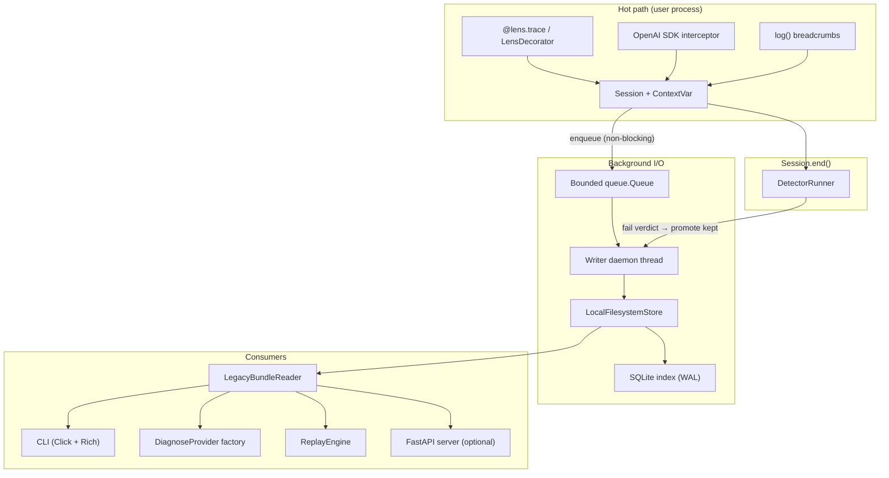

# autopsy

> _Your agent died. Here's why._

**autopsy** is observability for LLM agents: one decorator, full traces on disk, semantic failure detection, and a CLI to inspect and diagnose sessions when things go wrong.

```python
from autopsy import lens, log

@lens.trace
async def my_agent(query: str):
    log("fetch", source="web")
    ...
```

```bash
autopsy ls
autopsy show <session_id>
autopsy diagnose <session_id>
```

---

## Why autopsy?

When code breaks, you get a stack trace. When an **agent** breaks, it often returns confident nonsense — no exception, nothing in Sentry. autopsy captures the full run (LLM calls, tools, nested agents) and runs **detectors** that flag semantic failures, not just crashes.

---

## Install

Python **3.11+** required.

```bash
pip install autopsy                    # capture + CLI + heuristic diagnose
pip install "autopsy[server]"          # + local dashboard
pip install "autopsy[diagnose]"          # + LLM diagnose (OpenAI, Anthropic, Gemini)
pip install "autopsy[server,diagnose]" # full stack
```

**From source:**

```bash
git clone https://github.com/JNR-10/autopsy.git && cd autopsy
python -m venv .venv && source .venv/bin/activate
pip install -e ".[dev,server,diagnose]"
cp .env.example .env
```

---

## Quickstart

```python
from autopsy import lens, log

@lens.trace
async def my_agent(query: str) -> str:
    log("step", name="plan")
    return "result"
```

```bash
python my_agent.py
autopsy ls
autopsy show <session_id>
autopsy diagnose <session_id> --model auto
```

**Prefix IDs work:** `autopsy show 01HXY000` if the prefix is unique.

**JSON for scripts:** add `--json` to `ls`, `show`, `diagnose`, `tail`, `replay`.

---

## Everyday CLI

| Command | What it does |
|---------|----------------|
| `autopsy ls` | List saved sessions |
| `autopsy show <id>` | Detail + detector verdicts (`--events` for timeline) |
| `autopsy detectors` | List built-in detectors (`--list`) |
| `autopsy detectors <id>` | Re-run detectors on a saved v1 session |
| `autopsy diagnose <id>` | Root-cause analysis |
| `autopsy tail <id>` | Last N events, or live stream for in-progress sessions |
| `autopsy export` / `import` | Backup / restore sessions (tar.gz default) |
| `autopsy replay <id>` | Replay (`--live` re-runs agent module) |
| `autopsy clean --all` | Wipe local session store |

**Optional dashboard** (requires `[server]`):

```bash
autopsy serve                              # http://127.0.0.1:7823
autopsy run examples/broken_agent.py         # dashboard + script + demo mode
```

---

## Configuration (essentials)

Copy [`.env.example`](.env.example) or set env vars. Unified loader:

```python
from autopsy import load_config
cfg = load_config()
```

| Variable | Default | Meaning |
|----------|---------|---------|
| `AUTOPSY_SAMPLE` | `errors` | Keep all sessions (`all`), only failures (`errors`), or off |
| `AUTOPSY_SESSION_DIR` | auto | Where traces are stored |
| `AUTOPSY_DETECTORS` | all built-ins | `off` or comma-separated detector names |
| `AUTOPSY_DETECTOR_PROFILE` | — | `strict` \| `balanced` \| `lenient` (thresholds + buffers) |
| `AUTOPSY_PROMOTE_ON_WARN` | `0` | `1` to persist sessions on warn-only detector hits |
| `AUTOPSY_DIAGNOSE_MODEL` | `auto` | Diagnose provider (see developer guide) |
| `OPENAI_API_KEY` / `ANTHROPIC_API_KEY` / … | — | LLM keys for diagnose |

**Production tip:** leave `AUTOPSY_SAMPLE=errors` (default). **Local dev:** set `AUTOPSY_SAMPLE=all` while iterating.

**Performance (CLI / capture):**

| Variable | Default | When to change |
|----------|---------|----------------|
| `AUTOPSY_SAMPLE` | `errors` | Use `all` only when debugging — emits every node |
| `AUTOPSY_PRODUCTION_ALERTING` | off | Strict detectors + warn persistence; larger ring, no disk tail unless below |
| `AUTOPSY_DETECTOR_FULL_TRACE` | `0` | `1` merges spilled JSONL at session end (slower, more complete) |
| `AUTOPSY_DETECTORS` | all built-ins | Shorter comma list = faster `end()` |
| `AUTOPSY_MAX_DETECTOR_EVAL_EVENTS` | `8192` | Cap events passed to detectors on very long runs |

Sync decorator overhead is checked in the optional slow perf job (`pytest -m slow`).

---

## Examples

| Script | Purpose |
|--------|---------|
| [`examples/simple_agent.py`](examples/simple_agent.py) | Happy path |
| [`examples/broken_agent.py`](examples/broken_agent.py) | Overflow → diagnose → fix |
| [`examples/financial_research_pipeline.py`](examples/financial_research_pipeline.py) | Continuous multi-agent demo |

---

## License

MIT — see [CHANGELOG.md](CHANGELOG.md) for release history.

---

# Developer guide

Technical reference for contributors and integrators: architecture, internals, extension points, and development workflow.

## Table of contents

- [System architecture](#system-architecture)
- [Runtime data flow](#runtime-data-flow)
- [Capture layer](#capture-layer)
- [On-disk format](#on-disk-format)
- [Compatibility reader](#compatibility-reader)
- [Failure detection](#failure-detection)
- [Diagnostics layer](#diagnostics-layer)
- [CLI internals](#cli-internals)
- [Optional server & demo](#optional-server--demo)
- [Configuration reference](#configuration-reference)
- [Extension points](#extension-points)
- [Development](#development)
- [Project layout](#project-layout)
- [Design documents](#design-documents)

---

## System architecture

autopsy is four layers over a single hot path. The dashboard and LLM SDKs are optional; capture + CLI work with minimal dependencies.



**Dependency tiers**

| Tier | Install | Modules |
|------|---------|---------|
| Core | `pip install autopsy` | `core`, `detectors`, `diagnostics`, `cli`, `config` |
| Server | `[server]` | `server`, `demo` (routes gated by env) |
| Diagnose LLMs | `[diagnose]` | `openai`, `anthropic`, `google-genai` imports inside agents |

Core deps: `click`, `rich`, `pydantic`, `httpx`, `tiktoken`, `filelock`, `aiofiles`, `python-dotenv`.

---

## Runtime data flow

### 1. Root `@lens.trace` call

1. `LensDecorator` creates a lightweight `Session` (ULID, sample mode, optional detector list).
2. Session is stored in `current_session` ContextVar for nested calls and the OpenAI interceptor.
3. Under default `sample=errors`, the **Writer is deferred** — no disk I/O until a keep signal.

### 2. Event recording

Every span, LLM call, tool call, error, or `log()` becomes a **Pydantic v2** `BaseEvent` subclass:

| `EventKind` | Model | Emitted by |
|-------------|-------|------------|
| `session_start` / `session_end` | `SessionStartEvent`, `SessionEndEvent` | Decorator |
| `agent_start` / `agent_end` | `AgentStartEvent`, `AgentEndEvent` | Decorator (nested = agent spans) |
| `llm_request` / `llm_response` | `LLMRequestEvent`, `LLMResponseEvent` | OpenAI interceptor |
| `tool_call_start` / `tool_call_end` | `ToolCallStartEvent`, `ToolCallEndEvent` | Interceptor / user |
| `error` | `ErrorEvent` | Decorator on exception |
| `log` | `LogEvent` | `autopsy.log()` |
| `detector_verdict` | `DetectorVerdictEvent` | Detector runner at session end |
| `attachment_ref` | `AttachmentRefEvent` | Large payload spill |

Events append to:

- **In-memory capture buffer** on `Session` (bounded; used by detectors at end)
- **Writer queue** via `put_nowait` (drops + counts if queue full — never blocks user code)

### 3. Writer thread

Single daemon thread per process (`get_writer()` singleton):

```
declare → [kept | discarded] → finalize
```

| Transition | Trigger |
|--------------|---------|
| → **kept** | `sample=all`, head-rate hit, `ERROR` event, detector fail, in-flight buffer cap |
| → **discarded** | `end_session` and never kept |
| → **finalized** | `end_session` on kept session → manifest + gzip events + index upsert |

Sessions that never become **kept** never touch disk (default production behavior).

Writer batches flushes (`flush_batch_size`, `flush_interval_ms`), registers `atexit` shutdown, and runs eviction by age/disk cap.

### 4. Session.end()

On root span exit (success or exception):

1. `DetectorRunner` scans the capture buffer with enabled detectors.
2. Fail verdicts enqueue `detector_verdict` events and signal the Writer to **promote** (same path as errors).
3. Writer finalizes or discards based on keep state.

---

## Capture layer

### Public API

```python
from autopsy import lens, log, load_config, LensConfig, AutopsyConfig
from autopsy.core.decorator import LensDecorator
```

| API | Role |
|-----|------|
| `lens` | Module-level `LensDecorator` using env config |
| `@lens.trace(sample=..., name=..., detectors=...)` | Instrument async/sync callables |
| `log(name, **attrs)` | Structured breadcrumb; never raises |
| `load_config()` | `AutopsyConfig`: `.capture`, `.diagnose`, server/demo flags |

### Per-call overrides

```python
@lens.trace(sample="all")                    # force persist this call
@lens.trace(sample=0.1)                      # 10% head-rate + errors
@lens.trace(detectors=["tool_loop"])           # subset of detectors
@lens.trace(detectors=[])                      # disable detectors for this call
```

### Concurrency & safety

- **Hot path never raises** — queue full → drop + counter; writer errors logged.
- **ContextVar** isolation for nested agents and async tasks on same thread.
- **OpenAI interceptor** — install-once, refcounted; suppress during diagnose calls.
- **Redactor** hook on `LensConfig.redactor` applied in writer before disk.
- **Crash safety** — append-only `events.jsonl`; partial lines skipped on read; unfinalized sessions → `partial` on reindex.

### OpenAI SDK interception

`autopsy.core.interceptor` patches `openai` chat completions when importable. Captures model, messages, token estimates, latency, finish reason into the active session. Compatible with OpenAI-shaped APIs (Together, Groq, GMI proxy, etc.) when they use the same client.

---

## On-disk format

**Format version:** `autopsy_format_version: 1` in manifest.

```
<store_root>/
  sessions/
    <session_id>/
      manifest.json       # Manifest (Pydantic): status, error_type, counts, …
      events.jsonl.gz       # NDJSON events, gzipped at finalize
      artifacts/            # SHA-256 addressed blobs for large fields
  index.sqlite              # Derived; rebuild via store.reindex()
```

**Manifest `status`:** `live` → `ok` | `error` | `partial`

**Atomicity:** manifest write is tmp + rename; events fsync before gzip; index uses SQLite WAL for concurrent CLI reads during writes.

**Eviction:** age (`max_session_age_days`) then disk cap (`max_total_disk_mb`); pinned sessions skipped.

**Legacy v0:** single `sessions/<id>.json` blob — still readable, not written by v1 pipeline.

---

## Compatibility reader

`LegacyBundleReader` (`autopsy.core.compat`) is the **read seam** for all consumers:

- Reads v1 directories and v0 JSON blobs transparently
- Returns legacy **`TraceBundle`** dict: `events`, `node_index`, `dag_edges`, `summary`, …
- Maps v1 `EventKind` → legacy `event_type` strings for dashboard/diagnostics
- Maps fail `detector_verdict` → synthetic `node_error` for older UI paths

CLI, server, diagnose, and replay **never parse raw JSONL directly** — they go through this reader.

---

## Failure detection

Pluggable detectors run at **`Session.end()`** on a **merged event view**: in-memory capture buffer (default **1024 events / 8 MB**), the writer’s in-flight buffer, and any events already spilled to disk for that session. Tune via `AUTOPSY_MAX_CAPTURE_BUFFER_*` or a detector profile (below).

**Production profiles** (`AUTOPSY_DETECTOR_PROFILE`):

| Profile | Use when |
|---------|----------|
| `strict` | High-signal alerting: smaller buffers, tighter thresholds, **`promote_on_warn=1`** (warn-tier detectors persist sessions) |
| `balanced` | Default recommendation: larger buffers + enables `high_latency` / `error_storm` |
| `lenient` | Noisy agents: disables `unhandled_exception`, `duplicate_tool_args`, `token_budget_empty`; very large buffers |

For **warn-only production alerting**, use the one-shot preset or per-agent overrides:

```bash
export AUTOPSY_PRODUCTION_ALERTING=1   # strict + promote_on_warn + all detectors + full trace
# or per agent:
@lens.trace(detector_profile="strict", promote_on_warn=True, tool_loop_threshold=3)
```

**Full trace for detectors** (default on): `AUTOPSY_DETECTOR_FULL_TRACE=1` flushes the writer queue and merges up to `AUTOPSY_MAX_DETECTOR_RING_EVENTS` (default 8192) LLM/tool/error events even when the general capture buffer is smaller.

**Offline re-run:** `autopsy detectors <id>` works for **v1 sessions** and **legacy v0** JSON blobs (events are converted to v1 types automatically).

**False positives:** mark caught errors with `attributes={"handled": True}` on `ErrorEvent`, or use `lenient` profile / raise `AUTOPSY_DUPLICATE_TOOL_THRESHOLD`.

**12 detectors enabled by default** (see `autopsy detectors --list` for full catalog):

| Detector | What it catches |
|----------|-----------------|
| `empty_response` | Last LLM text empty with no later agent output |
| `tool_loop` | Consecutive same-tool spam or total tool cap |
| `missing_output` | `outcome=ok` but no LLM/agent output after work |
| `tool_failure` | Tool end events with `error` set |
| `truncated_output` | `finish_reason` length / max_tokens |
| `orphan_tool_call` | More tool starts than ends |
| `orphan_llm` | More LLM requests than responses |
| `llm_tool_without_execution` | Model returned `tool_calls` but no tool ran |
| `unhandled_exception` | `outcome=ok` with `ErrorEvent` recorded |
| `token_budget_empty` | High completion tokens, empty visible content |
| `content_filter` | Provider safety / content-filter block |
| `duplicate_tool_args` | Same tool+args repeated (stuck retry) |

**Optional (off by default):** `high_latency` (warn), `error_storm` (warn). Enable via `AUTOPSY_DETECTORS` or `@lens.trace(detectors=[...])`.

**Registry:** `detectors/registry.py` + `detectors/catalog.py` — `resolve_enabled(LensConfig)` builds the list from config/env.

**Runner:** `detectors/runner.py` — runs all detectors; never raises; emits `DetectorVerdictEvent`.

**Promotion:** Writer treats `DETECTOR_VERDICT` with `verdict=fail` like an error for `sample=errors` (optional `promote_on_warn` for warns).

### Adding a detector

1. Implement `Detector` protocol: `name: str`, `evaluate(events, outcome) -> DetectorVerdictEvent | None`
2. Register in `detectors/registry.py`
3. Add unit tests + integration test through real `Session.end()` wiring

---

## Diagnostics layer

### Provider protocol

```python
# autopsy/diagnostics/provider.py
class DiagnoseProvider(Protocol):
    @property
    def name(self) -> str: ...
    async def diagnose(self, bundle, target_node_id=None) -> DiagnosisResult: ...
```

### Built-in providers

| Name | Module | Client |
|------|--------|--------|
| `heuristic` | `heuristic.py` | Local rules; always available |
| `openai` | `openai_agent.py` | `openai.AsyncOpenAI` |
| `anthropic` | `anthropic_agent.py` | `anthropic.AsyncAnthropic` |
| `gmi` | `gmi_agent.py` | OpenAI client + GMI base URL |
| `gemini` | `gemini_agent.py` | `google.genai` async API |
| `ollama` | `ollama_agent.py` | `httpx` → `/api/chat` |

**Factory:** `resolve_diagnose_provider(config, model_choice=..., bundle=...)`

**`auto` selection:**

1. If `estimate_bundle_tokens(bundle) > auto_token_threshold` and Gemini key → Gemini
2. Else first available: OpenAI → GMI → Anthropic → Gemini → Ollama
3. Else heuristic

All providers share prompts (`prompts.py`), JSON extraction (`parsing.py`), and **heuristic fallback** on any failure.

### DiagnosisResult

Dataclass in `diagnostics/types.py` — stable JSON shape for CLI `--json` and server `/diagnose`.

### Adding a provider

1. Implement `DiagnoseProvider` (async `diagnose`, `.name`)
2. Wire factory in `provider.py`
3. Add optional dep in `pyproject.toml` if needed
4. Unit test factory selection + mocked HTTP; integration test CLI/server wiring

---

## CLI internals

Entry: `autopsy.cli.main:cli` (Click group).

| Module | Role |
|--------|------|
| `cli/resolve.py` | Session ID exact + prefix resolution |
| `cli/output.py` | Rich formatters + JSON serializers (`extract_detector_verdicts`, …) |
| `cli/tail.py` | Finalized last-N vs live poll loop |
| `cli/export_import.py` | Tarball + legacy JSON round-trip |

**Store root:** `AUTOPSY_SESSION_DIR` parent if path ends in `sessions`, else path itself — matches writer layout.

**Diagnose wiring:** `_make_diagnose_agent` → `resolve_diagnose_provider` (patchable in tests).

**Server commands:** `run` / `serve` require `[server]` extra; `run --demo` sets `AUTOPSY_DEMO=1` for hackathon examples.

---

## Optional server & demo

### Server (`autopsy.server`)

- **FastAPI** app: REST (`/api/sessions/...`), WebSocket (`/ws/live`), static fallback dashboard
- **Module-level** `create_app()`; `app = create_app()` for uvicorn
- Session delete uses `LocalFilesystemStore` (v1 dirs + legacy blobs)
- Version from `autopsy.__version__`

### Demo (examples only — not in the core wheel)

Hackathon routes live in **`examples/demo_routes.py`** and register only when `AUTOPSY_DEMO=1`:

- `autopsy run --demo` or `python examples/serve_with_demo.py`
- `POST /api/demo/fix`, `/api/demo/reset`, `GET /api/demo/status`

Example scripts (`examples/financial_research_pipeline.py`, etc.) read marker files under `~/.autopsy/fix_applied`. Production `autopsy serve` has no demo routes.

### Replay

- **Simulated (default):** `autopsy replay <id>` — comparison table, no agent re-run
- **Live:** `autopsy replay <id> --live` — re-imports `agent_module_path` from session manifest; requires root `@lens.trace` on that module
- Dashboard: enable **Live replay** on the diagnose panel (sends `live: true`)

---

## Configuration reference

### AutopsyConfig (`load_config()`)

```python
cfg = load_config()
cfg.capture      # LensConfig
cfg.diagnose     # DiagnoseConfig
cfg.server_host  # default 127.0.0.1
cfg.server_port  # default 7823
cfg.demo_enabled # AUTOPSY_DEMO=1
```

### Capture — `LensConfig` / `AUTOPSY_*`

| Variable | Default | Description |
|----------|---------|-------------|
| `AUTOPSY_SESSION_DIR` | auto | Store root |
| `AUTOPSY_SAMPLE` | `errors` | `all`, `errors`, `off`, or float 0–1 |
| `AUTOPSY_DETECTORS` | all | Comma list or `off` |
| `AUTOPSY_TOOL_LOOP_THRESHOLD` | `5` | Tool loop detector |
| `AUTOPSY_MAX_TOOL_CALLS` | `50` | Hard tool cap |
| `AUTOPSY_PROMOTE_ON_WARN` | `0` | Keep session on detector warn |
| `AUTOPSY_MAX_CAPTURE_BUFFER_EVENTS` | `256` | Detector buffer size |
| `AUTOPSY_MAX_CAPTURE_BUFFER_BYTES` | `2097152` | Detector buffer bytes |
| `AUTOPSY_QUEUE_MAXSIZE` | `10000` | Writer queue depth |
| `AUTOPSY_FLUSH_BATCH_SIZE` | `100` | Writer batch |
| `AUTOPSY_FLUSH_INTERVAL_MS` | `50` | Writer flush interval |
| `AUTOPSY_MAX_TOTAL_DISK_MB` | `2048` | Eviction cap |
| `AUTOPSY_MAX_SESSION_AGE_DAYS` | `30` | Eviction age |

### Diagnose — `DiagnoseConfig`

| Variable | Default |
|----------|---------|
| `AUTOPSY_DIAGNOSE_MODEL` | `auto` |
| `AUTOPSY_DIAGNOSE_TOKEN_THRESHOLD` | `32000` |
| `OPENAI_API_KEY`, `OPENAI_MODEL`, `OPENAI_BASE_URL` | —, `gpt-4o`, — |
| `ANTHROPIC_API_KEY`, `ANTHROPIC_MODEL` | —, `claude-sonnet-4-20250514` |
| `GMI_API_KEY`, `GMI_BASE_URL`, `GMI_DEFAULT_MODEL`, … | see `.env.example` |
| `GOOGLE_AI_API_KEY`, `GEMINI_MODEL` | —, `gemini-2.5-pro` |
| `OLLAMA_BASE_URL`, `OLLAMA_MODEL` | `http://localhost:11434`, `llama3.2` |
| `AUTOPSY_*_TIMEOUT` | per-provider seconds |

---

## Extension points

| Extend | Hook |
|--------|------|
| Custom detector | `Detector` protocol + registry |
| Custom diagnose provider | `DiagnoseProvider` + factory |
| Redaction | `LensConfig.redactor` callable |
| Export | `core/exporters/` (logging, file) |
| Store | `TraceStore` protocol — only `LocalFilesystemStore` ships today |

---

## Development

### Setup

```bash
python -m venv .venv && source .venv/bin/activate
pip install -e ".[dev,server,diagnose]"
cp .env.example .env
```

### Tests

```bash
.venv/bin/python -m pytest tests/ -q              # 247 tests (default)
.venv/bin/python -m pytest tests/ -m slow -q    # +3 slow (perf, crash, soak)
.venv/bin/ruff check autopsy tests
```

Layout: `tests/unit`, `tests/integration`, `tests/cli`, `tests/perf`.

**Conventions:** TDD for new features; CLI commands need unit + integration tests; patch `resolve_diagnose_provider` or `_make_diagnose_agent` for diagnose tests — not hand-built bundles for wiring tests.

### CI / release

- **CI:** `.github/workflows/ci.yml` — Python 3.11/3.12, core smoke install, ruff, full pytest
- **PyPI:** `.github/workflows/publish.yml` on GitHub Release (trusted publishing)
- **Changelog:** [CHANGELOG.md](CHANGELOG.md)

---

## Project layout

```
autopsy/
  __init__.py              # lens, log public exports
  config.py                # AutopsyConfig, load_config()
  core/
    decorator.py           # @lens.trace
    session.py             # Session.begin/end, capture buffer, detectors hook
    writer.py              # Daemon thread, sampling state machine
    store/                 # LocalFilesystemStore, SQLiteIndex
    events.py              # Pydantic event models + EventKind
    interceptor.py         # OpenAI SDK patch
    compat.py              # LegacyBundleReader
    replay.py              # Simulated + live replay
    config.py              # LensConfig
  detectors/               # Registry, runner, built-ins
  diagnostics/             # Providers, prompts, parsing, heuristic
  cli/                     # Click commands
  server/                  # FastAPI + dashboard JS ([server] extra)
  demo/                    # Demo routes (AUTOPSY_DEMO=1)
examples/                  # Not shipped in wheel
tests/
docs/superpowers/          # Specs + implementation plans
```

---

## Design documents

| Doc | Topic |
|-----|-------|
| `docs/superpowers/specs/2026-05-29-capture-layer-hardening-design.md` | Capture / writer / on-disk format |
| `docs/superpowers/specs/2026-05-30-failure-detection-design.md` | Detectors |
| `docs/superpowers/specs/2026-05-30-cli-diagnose-ux-design.md` | CLI |
| `docs/superpowers/specs/2026-05-30-provider-abstraction-design.md` | Diagnose providers |
| `docs/superpowers/specs/2026-05-30-dashboard-docs-design.md` | Dashboard + docs |
| `docs/superpowers/plans/*.md` | Step-by-step implementation plans |

---

**Repository:** https://github.com/JNR-10/autopsy
